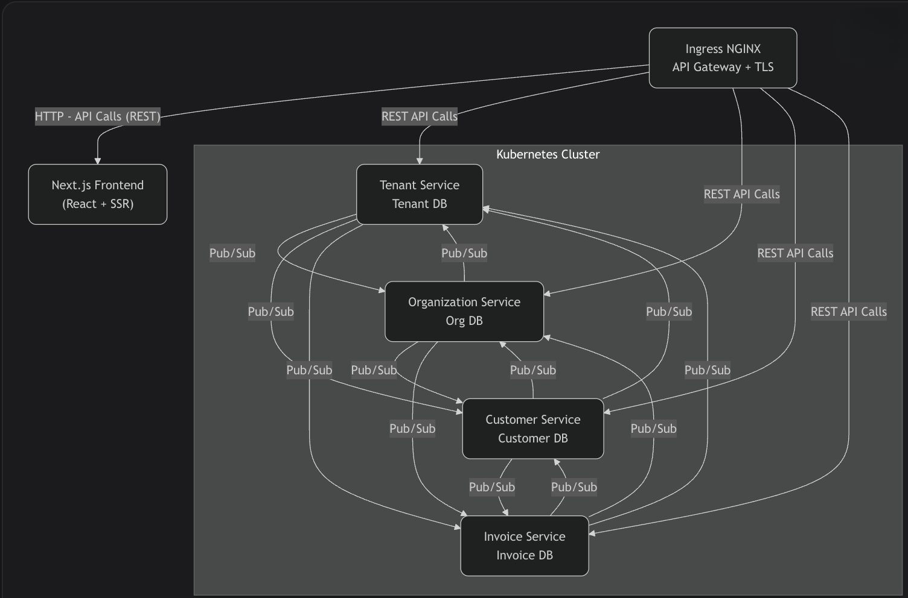

# 🚀 HawkInvoice - Multi-tenant SaaS for Invoice Management

[](https://opensource.org/licenses/MIT)
[](https://github.com/your-org/hawkinvoice/actions)
[](https://codecov.io/gh/your-org/hawkinvoice)

## 🖥 Backend

The frontend application for HawkInvoice is built with Next.js.

- **Repository**: [Frontend Repo](https://github.com/mohdyaserkt/hawkinvoice-microservices)

## 🧱 System Architecture

Below is a high-level overview of the HawkInvoice architecture.




## 📋 Overview

HawkInvoice is a scalable, cloud-native SaaS platform designed to streamline invoice management, financial tracking, and business operations for organizations of all sizes. Built with a microservices architecture, it ensures high scalability, maintainability, and performance while adhering to Clean Architecture and SOLID principles.


## 🌟 Features

- **Multi-tenant Architecture**: Secure isolation between different organizations
- **Invoice Lifecycle Management**: Create, send, track, and manage invoices
- **Customer Management**: Centralized customer database with interaction history
- **Organization Management**: Manage multiple organizations under a single account
- **Role-based Access Control**: Fine-grained permissions system
- **RESTful & gRPC APIs**: For seamless integration with other systems
- **Containerized Deployment**: Using Docker and Kubernetes
- **CI/CD Pipeline**: Automated testing and deployment


This is a [Next.js](https://nextjs.org/) project bootstrapped with [`create-next-app`](https://github.com/vercel/next.js/tree/canary/packages/create-next-app).

## Getting Started

First, run the development server:

```bash
npm run dev
# or
yarn dev
# or
pnpm dev
```

Open [http://localhost:3000](http://localhost:3000) with your browser to see the result.

You can start editing the page by modifying `app/page.tsx`. The page auto-updates as you edit the file.

This project uses [`next/font`](https://nextjs.org/docs/basic-features/font-optimization) to automatically optimize and load Inter, a custom Google Font.

## Learn More

To learn more about Next.js, take a look at the following resources:

- [Next.js Documentation](https://nextjs.org/docs) - learn about Next.js features and API.
- [Learn Next.js](https://nextjs.org/learn) - an interactive Next.js tutorial.

You can check out [the Next.js GitHub repository](https://github.com/vercel/next.js/) - your feedback and contributions are welcome!

## Deploy on Vercel

The easiest way to deploy your Next.js app is to use the [Vercel Platform](https://vercel.com/new?utm_medium=default-template&filter=next.js&utm_source=create-next-app&utm_campaign=create-next-app-readme) from the creators of Next.js.

Check out our [Next.js deployment documentation](https://nextjs.org/docs/deployment) for more details.
